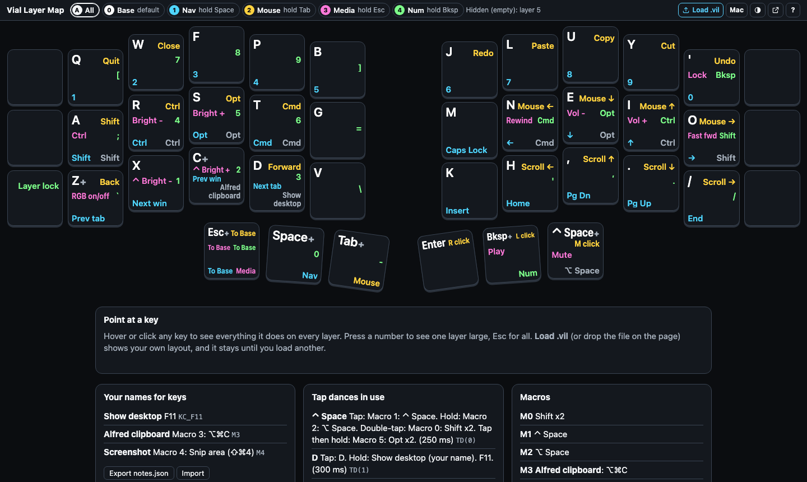

# Vial Layer Map

See every layer of your Vial keyboard layout on one screen, in plain words instead of raw keycodes.



**Run it now:** open **[dileeparanawake.github.io/vial-layers](https://dileeparanawake.github.io/vial-layers/)**,
or download this repo and double-click `index.html`. No install, no server.

- **Nothing collected.** No account, no tracking, no uploads. Your `.vil` never leaves your machine.
- **Lightweight.** One HTML file, about 100 KB, no dependencies, no build step.
- **Three ways in.** A link for anyone, its own app window, or offline with a hotkey. See [Three ways to open it](#three-ways-to-open-it).

## Why it exists

Learning a layered layout on a small keyboard means forgetting what is on each layer, a lot. Vial shows one layer at a time, with tap dances as `TD(3)` and mod-taps as raw codes, so answering "where is Page Down?" means opening the configurator, clicking through layers and decoding keycodes. On a Mac there is a second cost: the Vial desktop app is Intel-only and runs through Rosetta, which Apple is winding down.

This page is the quick answer: one file, opened in a browser, showing every layer at once, Miryoku-style. Each key shows its base legend at the top left, then what it does on each other layer in words, one colour and one fixed place per layer, and what it does on hold at the bottom right. `LSFT_T(KC_A)` reads as **A** with **Shift** on hold, `TD(3)` as **Space** with **Nav** on hold, `LGUI(KC_Z)` as **Undo**.

## How to use it

1. **Open the page.** Go to [dileeparanawake.github.io/vial-layers](https://dileeparanawake.github.io/vial-layers/), or download this repository and double-click `index.html`. No install, no server, no build step. It opens with a built-in example layout. (More ways, including its own app window and an offline hotkey, in [Three ways to open it](#three-ways-to-open-it).)
2. **Save your layout from Vial.** In Vial: File, Save current layout. That writes a `.vil` file.
3. **Click Load .vil** (the accented button in the toolbar, or press `O`) and choose the file, **or drop it anywhere on the page**. Your layout shows straight away.

### Your layout is kept

- **It stays after a reload.** The last `.vil` you loaded is kept in that browser (local storage), so the page opens on your layout next time, not the example.
- **Your names stay with it.** Names you give keys and layers are kept per layout (by the keyboard's `uid`), so they come back whenever that layout is loaded.
- **Back to the example:** the round-arrow button beside Load .vil (it shows only while your own file is loaded) goes back to the built-in example. Your names are not deleted; load your file again and they are back.
- Loading another `.vil` replaces the one kept. Nothing leaves your machine.

### Shortcuts

| Key | Does |
|---|---|
| `0` to `9` | Show that layer on its own, with larger legends. The key you hold to reach it is outlined and labelled |
| `Esc` or `A` | Back to all layers at once |
| `Left` / `Right` | Previous or next layer |
| `O` | Load your `.vil` |
| `M` | Mac or PC labels (Cmd and symbols, or Win and words) |
| `V` | Open Vial web in a new tab, to change the layout |
| `?` | Shortcut help |

- **Hover or click a key** to see everything it does on every layer, in words, with the raw keycode alongside. Keys are drawn as keycaps: hovering presses one half way, and clicking pins it, pressed down, until you click it again (or `Tab` to it and press `Enter`; `Esc` releases it). With reduced motion set in your system, the keys change shade without moving.
- **Double-click a layer name** to rename it. Names are guessed from the contents (arrows make **Nav**, mouse keys **Mouse**, media keys **Media**, digits **Num**), and your renames are remembered per layout.
- A **+** after a legend means the key does more (double-tap, tap then hold). The single-layer view spells it out.
- Empty layers are hidden and listed beside the layer buttons. Tap dances, macros, combos and key overrides in use are listed under the map.
- `index.html?layer=1` opens straight onto layer 1; `?layer=all` onto the overview.
- **The whole keyboard fits the window** and scales with it, and **every layer's legend is shown in words on every key**, never as a dot. A legend too long for its line first gets narrower letters and smaller type (never below 9px), then its row takes two lines, then, if the window has the height, all the keys grow a little taller than wide. Only if it still cannot fit is a legend shortened (`To Base` to `Base`, `Alfred clipboard` to `Clip`). The full wording is always in the panel and the tooltip.
  - 1440 by 900: 99px square keys, smallest legend 12px, nothing shortened.
  - 1000 by 600: 68 by 73px keys, smallest legend 9px, nothing shortened.
  - 750 by 400: 52 by 67px keys (taller than wide, to keep the words), smallest legend 9px, nothing shortened.
  - A window too small for 48px keys scrolls sideways rather than shrink them further. On a phone the two halves stack, left over right.

### Naming what a key does

Macros show as their keystrokes (`⌥⌘C`) until you name them. Pin a key, then use **Name** in the panel (one button per action: tap, hold, double-tap, tap then hold). Your name, such as **Alfred clipboard** for macro 3, then shows wherever that action appears.

Names are kept in your browser. To keep them with the page:

1. Click **Export notes.json** (under the map) and save it over `notes.json` beside `index.html`.
2. Run `python3 tools/embed.py`, so the page also has them when opened by double-click. (A browser will not let a page opened as a file read the file next to it, so the names are copied into `index.html`.)

**Import**, or dropping a `notes.json` on the page, loads a set. A `notes.json` names keycodes, so it only makes sense with the layout it was written for; its `uid` ties it to that keyboard.

## Three ways to open it

**A. In a browser tab.** Open [dileeparanawake.github.io/vial-layers](https://dileeparanawake.github.io/vial-layers/). Nothing to install. Needs internet.

**B. As its own app window, from the live page (no download).**

1. Open the page in Chrome or Edge.
2. **Chrome:** menu, **Cast, save and share**, **Install page as app**. **Edge:** menu, **Apps**, **Install this site as an app**.
3. **Safari 17 or later, on a Mac:** File, **Add to Dock**.

The menu item only shows on the live page, not on a copy opened from your disk. It then opens like any other app (on a Mac, from the Dock, Launchpad or Spotlight). A launcher such as Alfred, Raycast or macOS Shortcuts can give it a hotkey. It needs internet each time it opens, as the page is not cached for offline use.

**C. Offline, with a hotkey (macOS and Chrome).** A web page cannot catch a key while another app has focus, so this needs something on the Mac to open it. Download or clone this repository. `hotkey/open-layer-map.sh` opens the local `index.html` as its own small Chrome window (Chrome's `--app` mode, with no tabs or address bar). Point a hotkey at this command:

```
sh /path/to/vial-layers/hotkey/open-layer-map.sh
```

1. **macOS Shortcuts (built in).** New shortcut, add **Run Shell Script** with that command, then in the shortcut's details choose **Add Keyboard Shortcut**.
2. **Alfred (Powerpack).** A workflow with a **Hotkey** trigger, then **Run Script** with that command.
3. **Karabiner-Elements.** Edit the path in `hotkey/karabiner-vial-layers.json` to where you put this folder, copy the file into `~/.config/karabiner/assets/complex_modifications/`, then in Karabiner: Complex Modifications, Add rule, enable **Vial layer map**. The trigger is Hyper+K (Ctrl+Opt+Shift+Cmd+K).

The script needs macOS and Google Chrome. It is run with `sh`, so it does not need to be made executable. The window has no tabs, so links from it (**Edit in Vial**, the credit links) open in your normal Chrome window. An optional argument opens a layer: `open-layer-map.sh 1` opens layer 1.

Nicest of all: put that hotkey on the keyboard itself, as a key on one of your layers, so the keyboard can show its own map. In Vial, one key can send Hyper+K in a single press: give it the keycode `HYPR(KC_K)`.

| | A. Browser tab | B. App window | C. Offline hotkey |
|---|---|---|---|
| **Install** | Nothing | From the browser menu | Download the repo, set up a hotkey |
| **Own window** | No | Yes | Yes |
| **Works offline** | No | No | Yes |
| **Updates** | Always the published version | Always the published version | Whatever you downloaded (`git pull` to update) |
| **Hotkey** | Through a launcher | Through a launcher | Yes, script included |
| **Platforms** | Any modern browser | Chrome or Edge on any OS, Safari 17+ on Mac | macOS with Chrome |

Your saved layout and names are kept in browser storage, which is separate for each browser and each site, so the hosted page and a downloaded copy do not share them. Load your `.vil` once in whichever you use.

## Privacy

It runs entirely in your browser and only reads. Your `.vil` file is never uploaded: there is no server, and the page makes no network requests of its own (served over http, it reads the `notes.json` beside it; nothing else). It cannot change anything on your keyboard. The last layout you loaded and your names are kept in your browser's local storage, on your machine.

## What it works with

- **Browsers:** tested in Chrome. It uses nothing browser-specific, so current Safari, Firefox and Edge should work too. **Edit in Vial** opens Vial web, which needs Chrome, Edge or Arc (Safari and Firefox have no WebHID).
- **Offline hotkey:** `hotkey/open-layer-map.sh` needs macOS and Google Chrome.
- **Keyboards:** any Vial keyboard. The Corne (3x6+3, including rev4 with its extra inner keys) is drawn in its real shape: six columns a half, the outer column drawn even where nothing is mapped on it, and three thumb keys tucked in close under the inner columns in a gentle row. Rev4's extra inner keys are drawn when something is mapped on them. Other boards show as a plain grid for now.
- **Colours:** every legend colour reaches WCAG AA contrast for small text (4.5 to 1) on the key face, hovered or pressed, in both themes; the tests check it.

## Limitations

- **It reads a saved `.vil`, not the keyboard itself.** Change a key in Vial and the map shows the old layout until you save and load the `.vil` again. How reading straight from the keyboard could work is in [docs/reading-from-the-keyboard.md](docs/reading-from-the-keyboard.md).
- **Only the Corne has a drawn shape.** Other boards show as a plain grid. Reading the physical layout from the keyboard's Vial definition would generalise it.
- **Encoders** (`encoder_layout`) are not drawn.
- **The hosted page needs internet**, in a tab or as an installed app. It is not cached for offline use; the offline hotkey is the offline route.
- **Your saved layout and names live in one browser**, per site. Another browser, another machine, a private window or clearing site data starts from the example again.
- **Tested in Chrome only.** Safari, Firefox and Edge should work but have not been checked.
- **The offline hotkey script** needs macOS and Google Chrome.

**Why Vial web is not embedded in the page.** `vial.rocks` allows framing, and WebHID can be delegated to a frame, but Vial web needs `SharedArrayBuffer`, which a browser only enables when the top-level page is cross-origin isolated (COOP and COEP headers). A local file cannot send headers, so in a frame Vial fails on start. **Edit in Vial** opens it in its own tab instead.

## Related tools

- **[keymap-drawer](https://github.com/caksoylar/keymap-drawer)** (caksoylar) renders QMK and ZMK keymaps to SVG. It draws each layer as its own keyboard, and the output is a static image. It does not read `.vil` directly.
- **[Vial To Keymap Drawer](https://yal-tools.github.io/vial-to-keymap-drawer/)** (YellowAfterlife) converts `.vil` to keymap-drawer YAML.

Together they make a good image for sharing a layout. This page is for the other job: "what is on this key?", answered in a couple of seconds.

## Files

```
index.html                  the whole app: markup, styles, parser, UI, built-in example layout
WHY.md                      what it is for, and the test it has to pass
layouts/miryoku-11.vil      the example layout
notes.json                  names for what keys do, the defaults
tools/embed.py              copies a .vil and notes.json into index.html as the built-in defaults
test/parse.test.mjs         parser tests against the example layout (node test/parse.test.mjs)
hotkey/open-layer-map.sh    opens the map in its own Chrome window
hotkey/karabiner-vial-layers.json   optional Karabiner rule for a Hyper+K hotkey
docs/                       screenshots, and the route for reading from the keyboard
```

To change the built-in layout: copy your `.vil` into `layouts/`, then run `python3 tools/embed.py layouts/<file>.vil`.

## Licence

MIT, see [LICENSE](LICENSE).

Vial Layer Map is an independent project, not affiliated with Vial.
